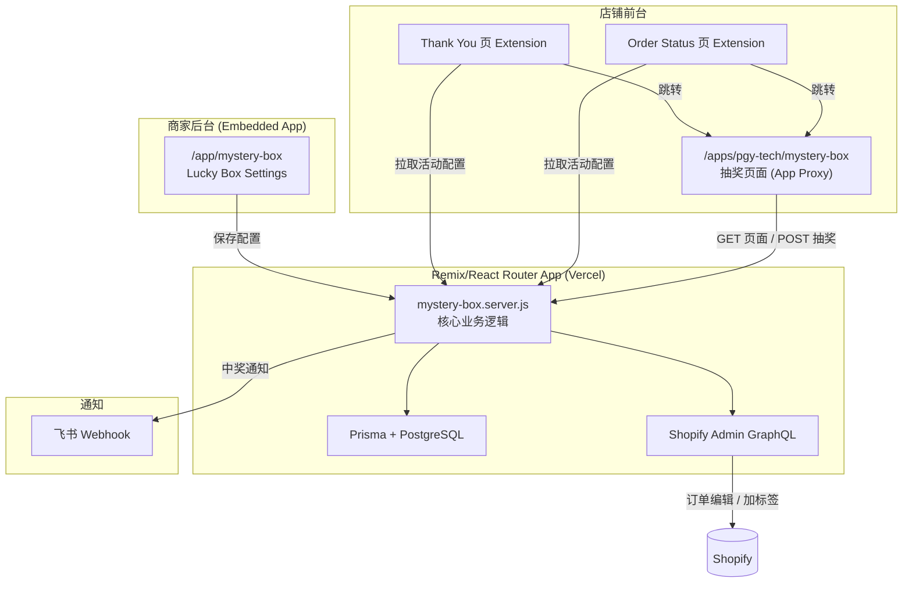
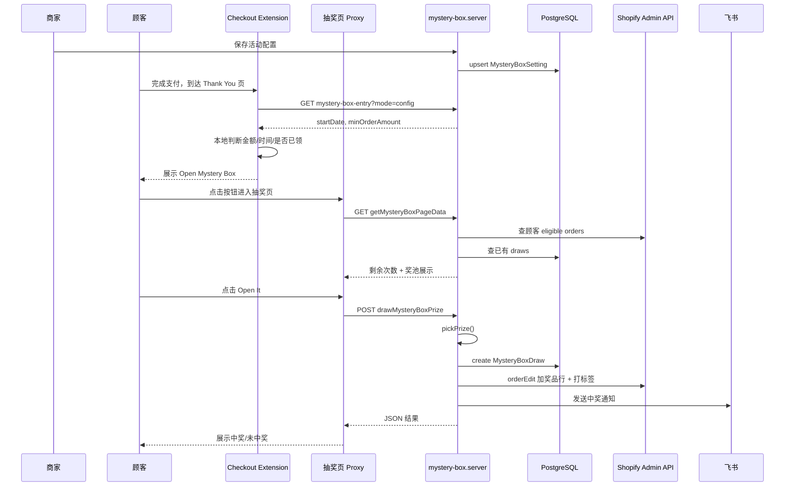

# Mystery Box（Lucky Box）盲盒抽奖功能文档

## 1. 功能目标

为 PGY Tech Shopify 店铺提供**订单驱动的盲盒抽奖**活动：

- 顾客在活动期间完成**达标订单**（金额 ≥ 门槛、且下单时间在活动开始之后），可获得 **1 次抽奖机会**（每个订单 1 次）。
- 顾客在前台打开盲盒，按配置概率抽取奖品或「未中奖」。
- 中奖后系统自动将奖品写入原订单（100% 折扣行项），并打订单标签、发送飞书通知。
- 商家在 App 后台配置活动规则、美区/非美区两套奖池、最低订单金额、飞书 Webhook 等。

---

## 2. 整体架构



**三条用户路径：**

| 路径 | 入口 | 作用 |
|------|------|------|
| 商家配置 | App 内 `/app/mystery-box` | 设置活动时间、门槛、奖池概率 |
| 活动入口 | Checkout Extension（Thank You / Order Status） | 达标订单展示「Open Mystery Box」按钮 |
| 抽奖执行 | App Proxy `/apps/pgy-tech/mystery-box` | 登录顾客查看资格、开盒、查看记录 |

---

## 3. 开发流程（Git 历史）

功能在 **2026-08-13 ~ 2026-08-14** 分 3 个 commit 落地：

| Commit | 日期 | 说明 | 主要变更 |
|--------|------|------|----------|
| `beaa353` add luck deal | 2026-08-13 | **初版全量实现** | 数据库迁移、server 逻辑、后台页、App Proxy 抽奖页、Checkout Extension、CORS/Proxy 路由 |
| `a1af402` flx: luck | 2026-08-13 | **服务端修复** | `mystery-box.server.js` 订单查询/资格判断相关 bugfix |
| `2ae6ce9` afdd | 2026-08-14 | **UI 与入口优化** | 抽奖页 UI 大幅增强、盲盒封面图、Extension 本地判断逻辑、Prisma 预 dev 脚本 |

### 推荐开发顺序（学习时可按此复现）

1. **数据层**：Prisma schema + migration（`MysteryBoxSetting` / `MysteryBoxDraw`）
2. **核心服务**：`app/lib/mystery-box.server.js`（配置 CRUD、资格校验、抽奖、订单编辑、飞书通知）
3. **商家后台**：`app/routes/app.mystery-box.jsx`
4. **顾客抽奖页**：`app/routes/apps.pgy-tech.mystery-box.jsx`（App Proxy，SSR HTML + 内联 JS）
5. **入口 Extension**：`extensions/pgy-mystery-box-entry`（Thank You + Order Status）
6. **入口 API**：`apps.pgy-tech.mystery-box-entry.jsx` + `api.mystery-box-entry.jsx`（CORS + 配置下发）
7. **部署配置**：`vercel.json` CORS headers、`shopify.app.toml` App Proxy + scopes、`entry.server.jsx` OPTIONS 预检

---

## 4. 文件结构

```
app/
├── lib/mystery-box.server.js          # 核心业务（~1500 行）
├── routes/
│   ├── app.mystery-box.jsx            # 商家后台配置页
│   ├── apps.pgy-tech.mystery-box.jsx  # 顾客抽奖页（App Proxy）
│   ├── apps.pgy-tech.mystery-box-entry.jsx  # Extension 配置/状态 API（Proxy）
│   └── api.mystery-box-entry.jsx    # Extension 状态 API（直连，带 Session Token 鉴权）
├── entry.server.jsx                   # OPTIONS 预检处理
extensions/pgy-mystery-box-entry/
├── shopify.extension.toml             # UI Extension 声明
├── src/
│   ├── Entry.jsx                      # 共用入口 UI 组件
│   ├── ThankYou.jsx                   # 结账感谢页 target
│   └── OrderStatus.jsx                # 订单详情页 target
prisma/
├── schema.prisma                      # MysteryBoxSetting / MysteryBoxDraw
└── migrations/20260810143000_add_mystery_box/
public/images/mystery-box-front.png    # 盲盒封面图（base64 嵌入页面）
docs/mystery-box-feature.md            # 本文档
```

---

## 5. 数据库设计

### 5.1 MysteryBoxSetting（每店铺一条）

| 字段 | 类型 | 说明 |
|------|------|------|
| shop | String @unique | 店铺域名 |
| startDate | DateTime | 活动开始时间（存储 UTC，展示/输入用 PDT） |
| minOrderAmount | Decimal | 最低订单金额门槛 |
| webhookUrl | String? | 飞书机器人 Webhook |
| usRules | Json | 美区奖池配置 |
| intlRules | Json | 非美区奖池配置 |

**Rules JSON 结构：**

```json
{
  "prizes": [
    { "sku": "ABC-001", "title": "", "imageUrl": "", "imageAlt": "", "price": "", "probability": 10 },
    { "sku": "ABC-002", "title": "", "imageUrl": "", "imageAlt": "", "price": "", "probability": 5 },
    { "sku": "ABC-003", "title": "", "imageUrl": "", "imageAlt": "", "price": "", "probability": 5 }
  ],
  "noPrizeProbability": 80
}
```

- 3 个 SKU 奖品 + 1 个「未中奖」概率，**总和必须 = 100**。
- 保存时通过 Admin GraphQL 按 SKU 自动补全 `title`、`imageUrl`、`price`。

### 5.2 MysteryBoxDraw（抽奖记录）

| 字段 | 说明 |
|------|------|
| shop + orderId | 联合唯一，保证每订单只抽一次 |
| customerId | 顾客 ID |
| region | `US` 或 `INTL`（按 IP 国家码判断） |
| prizeType | `prize` 或 `none` |
| prizeSku / prizeTitle | 中奖信息 |
| orderTotal | 订单金额快照 |
| ipAddress | 抽奖 IP |

---

## 6. 商家后台（Admin）

**路由：** `/app/mystery-box`  
**鉴权：** `authenticate.admin(request)`

### 配置项

- **Order start date/time (PDT)**：活动开始时间
- **Minimum order amount**：最低订单金额
- **Feishu webhook**：中奖通知地址
- **US rules / Non-US rules**：各 3 个 SKU + 概率 + 未中奖概率

### 校验规则（`validateRules`）

1. 概率 > 0 的奖品必须填 SKU
2. 四个概率之和必须等于 100（允许 0.001 误差）
3. 最低订单金额必须 > 0

保存时会调用 `enrichRulesWithVariantData`，通过 GraphQL `productVariants(query: "sku:...")` 拉取商品图片和标题。

---

## 7. 顾客抽奖页（App Proxy）

**路由：** `/apps/pgy-tech/mystery-box`  
**鉴权：** `authenticate.public.appProxy(request)`  
**顾客识别：** URL 参数 `logged_in_customer_id`（Shopify App Proxy 自动注入）

### GET — 渲染 HTML 页面

`loader` 调用 `getMysteryBoxPageData(request)`，返回页面状态：

| status | 含义 |
|--------|------|
| `not_configured` | 未配置活动 |
| `login_required` | 未登录，显示登录按钮 |
| `ready` | 已登录，可查看资格和抽奖 |

页面特性：

- **服务端渲染 HTML**（非 React SPA），内联 CSS + 原生 JS
- 盲盒封面图从 `public/images/mystery-box-front.png` 读入并 **base64 嵌入**
- 展示奖池卡片、剩余抽奖次数、历史记录弹窗、规则弹窗
- `?status=1` 时返回 JSON 状态（供轮询）

### POST — 执行抽奖

`action` 调用 `drawMysteryBoxPrize(request)`，前端 `fetch` 同路径 + `window.location.search`（保留 Proxy 签名参数）。

---

## 8. Checkout UI Extension（活动入口）

**Extension 名称：** `PGY Mystery Box Entry`  
**Targets：**

- `purchase.thank-you.block.render` → `ThankYou.jsx`
- `customer-account.order-status.block.render` → `OrderStatus.jsx`

### 显示逻辑（Entry.jsx）

Extension **不直接调用抽奖 API**，而是：

1. 启动时从 `https://pgy-tech.vercel.app/apps/pgy-tech/mystery-box-entry?mode=config` 拉取活动开始时间和最低金额
2. 本地读取订单数据（金额、行项、processedAt）
3. 判断是否展示入口：

```
show = isEditor || (afterActivityStart && (alreadyClaimed || eligible))
```

- **eligible**：订单金额 ≥ minOrderAmount
- **alreadyClaimed**：订单行项中存在「custom 类型 100% 折扣的 0 元行」（即已中奖写入的奖品行）
- **isEditor**：Shopify 编辑器预览模式，始终显示

达标且未领取时展示 **Open Mystery Box** 按钮，链接到 `/apps/pgy-tech/mystery-box`（店铺域名下的 App Proxy 路径）。

### 为何有两套 Entry API？

| 路由 | 场景 |
|------|------|
| `/apps/pgy-tech/mystery-box-entry` | Extension 拉 config（无需 Session Token） |
| `/api/mystery-box-entry` | 带 Checkout/Customer Account Session Token 的 draw 状态查询 |

两者都配置了 CORS（`vercel.json` + route headers + `entry.server.jsx` OPTIONS）。

---

## 9. 核心业务逻辑详解

### 9.1 地区判定

```javascript
// detectRegion(request)
// 读取 cf-ipcountry / x-vercel-ip-country / x-country-code
// US → 使用 usRules，否则 intlRules
```

### 9.2 订单资格（findEligibleOrders）

GraphQL 查询：

```
customer_id:{id} created_at:>={startDate} financial_status:paid status:any
```

过滤条件：

- 订单金额 ≥ `minOrderAmount`
- 该订单在 `MysteryBoxDraw` 中尚无记录

**一订单一次机会**，`(shop, orderId)` 数据库唯一约束保证。

### 9.3 抽奖算法（pickPrize）

加权随机：

1. 将 3 个 SKU 奖品 + `noPrize` 组成候选池
2. 按 probability 累加，`Math.random() * total` 落点选取

### 9.4 中奖后订单处理（addPrizeVariantToOrder）

若 `prizeType === "prize"` 且有 SKU：

1. **优先**：按 SKU 找 variant → `orderEditBegin` → `orderEditAddVariant` → `orderEditAddLineItemDiscount(100%)` → `orderEditCommit`
2. **兜底**：找不到 variant 时，`orderEditAddCustomItem`（0 元自定义行项）
3. 给订单打标签：`8月盲盒活动中奖`
4. 发送飞书 Interactive Card 通知

### 9.5 飞书通知内容

- 店铺、订单号、客户名、联系方式
- 地区规则（美区/美区外）
- 订单金额、抽奖结果、是否成功写入订单

### 9.6 时间处理

活动开始时间以 **PDT（UTC-7）** 为业务时区：

- 后台输入 `datetime-local` → `parsePdtDateInput` 转 UTC 存库
- 展示时用 `dateInputValue` 转回 PDT 字符串

---

## 10. Shopify 权限与 Proxy 配置

### App Proxy（shopify.app.toml）

```toml
[app_proxy]
url = "/apps/pgy-tech"
prefix = "apps"
subpath = "pgy-tech"
```

顾客访问 `https://{shop}.com/apps/pgy-tech/mystery-box` → 转发到 Vercel app。

### 所需 Scopes

```
read_orders, write_orders,
read_order_edits, write_order_edits,
read_products, read_customers,
write_app_proxy
```

`write_order_edits` 用于中奖后编辑订单；`write_orders` 用于打标签。

---

## 11. 端到端用户流程



---

## 12. 关键设计决策（值得学习）

### 12.1 抽奖页用 SSR HTML 而非 React 组件

**原因：** App Proxy 页面面向店铺前台顾客，不需要 Embedded App 的 Polaris/UI 体系；SSR HTML 零 hydration 依赖，加载快，且便于嵌入 base64 图片。

### 12.2 Extension 本地判断 + 远端只下发 config

**原因：** Thank You / Order Status Extension 运行在 Shopify 沙箱，网络请求受限；把「是否达标」放在本地（订单金额、行项结构），只拉轻量 config，减少 API 调用和鉴权复杂度。

### 12.3 已领取检测的双重机制

| 场景 | 检测方式 |
|------|----------|
| Extension 入口 | 订单行项：0 元 + custom discount |
| 服务端 Entry API | 订单 tag `8月盲盒活动中奖` 或 DB `MysteryBoxDraw` |
| 抽奖资格 | DB `(shop, orderId)` 唯一约束 |

Extension 用行项结构判断是因为顾客侧拿不到 Admin API 的 tags；服务端用 tag + DB 保证一致性。

### 12.4 美区 / 非美区双奖池

同一店铺可配置不同 SKU 和概率，按 IP 国家码自动切换，无需顾客手动选择。

### 12.5 防御性数据库检测

`hasMysteryBoxModels()` / `isMissingMysteryBoxTableError()` 在 migration 未执行时给出明确提示，避免线上直接 500。

---

## 13. 本地开发与部署

```bash
# 1. 数据库迁移
npm run db:deploy
npx prisma generate

# 2. 启动 dev
npm run dev

# 3. 部署 Extension
shopify app deploy
```

**注意：**

- Extension 中 `ENTRY_API_ORIGIN` 硬编码为 `https://pgy-tech.vercel.app`，本地调试需改或用 tunnel
- App Proxy 路径需在 Shopify Partner 后台与 `shopify.app.toml` 一致
- 抽奖页封面图放在 `public/images/mystery-box-front.png`

---

## 14. 扩展与改进方向

- 活动结束时间、每人总次数上限
- 后台抽奖记录列表与导出
- Extension 改用 Session Token API 统一已领取状态（减少行项启发式误判）
- 抽奖页 i18n（当前为英文 UI）
- 更灵活的奖品数量（当前固定 3 SKU + 未中奖）

---

## 15. 相关代码入口速查

| 能力 | 文件 | 函数/路由 |
|------|------|-----------|
| 保存配置 | `mystery-box.server.js` | `saveMysteryBoxSetting` |
| 页面数据 | `mystery-box.server.js` | `getMysteryBoxPageData` |
| 执行抽奖 | `mystery-box.server.js` | `drawMysteryBoxPrize` |
| 入口状态 | `mystery-box.server.js` | `getMysteryBoxEntryConfig` |
| 商家 UI | `app.mystery-box.jsx` | `/app/mystery-box` |
| 顾客 UI | `apps.pgy-tech.mystery-box.jsx` | `/apps/pgy-tech/mystery-box` |
| Extension | `Entry.jsx` | `MysteryBoxEntry` 组件 |
