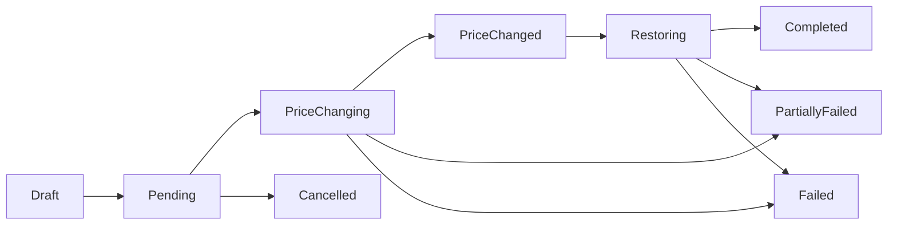

# 定时改价任务功能设计文档

## 1. 背景与目标

商家需要在指定时间批量调整商品 SKU 价格，并在活动结束后自动恢复原价。当前功能目标是提供一个可视化任务管理页面，支持创建“定时改价任务”，通过 Excel 批量导入 SKU 与目标价格，系统按设定时间自动执行改价与恢复。

## 2. 功能范围

### 2.1 本期范围

- 提供定时改价任务列表页。
- 支持新建定时改价任务。
- 新建任务时可设置：
  - 任务名称。
  - 改价执行时间。
  - 恢复价格时间。
  - Excel 文件上传。
- 系统自动读取 Excel 中的 SKU 和目标价格。
- 系统在改价执行时间批量修改对应 SKU 的价格。
- 系统在恢复价格时间批量恢复 SKU 原价。
- 支持查看任务状态、执行结果、失败原因和明细。

### 2.2 暂不包含

- 不支持复杂促销规则计算，例如按折扣比例、满减、阶梯价自动生成价格。
- 不支持同一个任务内设置多个改价时间段。
- 不支持针对不同店铺市场、币种、客户分组分别改价。
- 不支持任务执行中的人工审批流。

## 3. 页面设计

### 3.1 任务列表页

路径建议：`/app/price-tasks`

页面用途：展示所有定时改价任务，支持进入新建页面、查看详情和管理任务。

#### 主要操作

- 新建任务：点击后进入新建定时改价任务页面。
- 查看详情：查看任务配置、导入明细、执行日志。
- 取消任务：仅允许取消未开始执行的任务。
- 下载导入文件：用于复查当时上传的 Excel。
- 下载执行结果：导出每个 SKU 的执行状态与失败原因。

#### 列表字段

| 字段 | 说明 |
| --- | --- |
| 任务名称 | 商家创建任务时填写 |
| SKU 数量 | Excel 中通过校验的 SKU 总数 |
| 改价时间 | 到达该时间后执行目标价格 |
| 恢复时间 | 到达该时间后恢复原价 |
| 任务状态 | 草稿、待执行、改价中、已改价、恢复中、已完成、部分失败、失败、已取消 |
| 创建时间 | 任务创建时间 |
| 创建人 | 当前店铺操作用户，如系统无法识别则记录店铺 |
| 操作 | 详情、取消、下载结果 |

### 3.2 新建定时改价任务页

路径建议：`/app/price-tasks/new`

页面用途：创建一个新的批量定时改价任务。

#### 表单字段

| 字段 | 类型 | 必填 | 校验规则 |
| --- | --- | --- | --- |
| 任务名称 | 文本输入 | 是 | 1-100 个字符 |
| 改价时间 | 日期时间选择器 | 是 | 必须晚于当前时间 |
| 恢复价格时间 | 日期时间选择器 | 是 | 必须晚于改价时间 |
| Excel 文件 | 文件上传 | 是 | 仅支持 `.xlsx`、`.xls`，大小建议不超过 10 MB |

#### 页面流程

1. 用户点击任务列表页的“新建任务”。
2. 系统进入新建页面。
3. 用户填写任务名称、改价时间、恢复价格时间。
4. 用户上传 Excel 文件。
5. 系统解析 Excel，展示 SKU 和目标价格预览。
6. 系统校验 SKU 是否存在、价格是否合法、是否存在重复 SKU。
7. 用户确认无误后点击“创建任务”。
8. 系统保存任务，状态变为“待执行”。
9. 返回任务列表页。

#### Excel 预览区

上传后展示解析结果：

| 字段 | 说明 |
| --- | --- |
| 行号 | Excel 原始行号 |
| SKU | 商品变体 SKU |
| 当前价格 | 系统从 Shopify 读取的当前价格 |
| 目标价格 | Excel 中填写的新价格 |
| 校验状态 | 通过、SKU 不存在、价格格式错误、重复 SKU、缺少必填字段 |
| 错误原因 | 具体错误信息 |

创建任务时，仅允许全部数据校验通过后提交。若存在错误，页面需要提示用户下载错误明细并重新上传。

## 4. Excel 模板

### 4.1 Sheet 要求

- 默认读取第一个 Sheet。
- 第一行为表头。
- 从第二行开始读取数据。
- 空行自动忽略。

### 4.2 字段要求

| 列名 | 必填 | 示例 | 说明 |
| --- | --- | --- | --- |
| SKU | 是 | `ABC-001` | 商品变体 SKU，需与 Shopify 商品变体 SKU 完全一致 |
| Target Price | 是 | `19.99` | 改价后的目标价格，必须大于等于 0 |

### 4.3 模板示例

| SKU | Target Price |
| --- | --- |
| ABC-001 | 19.99 |
| ABC-002 | 24.99 |

### 4.4 校验规则

- SKU 不能为空。
- Target Price 不能为空。
- Target Price 必须为合法数字。
- Target Price 不允许为负数。
- 同一个 Excel 中 SKU 不允许重复。
- SKU 必须能匹配到 Shopify 商品变体。
- 若 SKU 匹配到多个变体，应标记为异常并禁止创建任务。

## 5. 任务状态

| 状态 | 说明 |
| --- | --- |
| Draft | 草稿，数据尚未提交 |
| Pending | 待执行，任务已创建，等待改价时间 |
| PriceChanging | 改价中 |
| PriceChanged | 已完成改价，等待恢复价格 |
| Restoring | 恢复中 |
| Completed | 改价与恢复均成功 |
| PartiallyFailed | 部分 SKU 执行失败 |
| Failed | 全部或关键步骤失败 |
| Cancelled | 已取消 |

状态流转：

## 6. 数据模型建议

### 6.1 PriceChangeTask

| 字段 | 类型 | 说明 |
| --- | --- | --- |
| id | string | 任务 ID |
| shop | string | Shopify 店铺域名 |
| name | string | 任务名称 |
| status | string | 任务状态 |
| scheduledChangeAt | datetime | 改价执行时间 |
| scheduledRestoreAt | datetime | 恢复价格时间 |
| fileName | string | 原始 Excel 文件名 |
| fileUrl | string | 文件存储地址，可选 |
| totalCount | number | 总 SKU 数 |
| successCount | number | 成功数量 |
| failedCount | number | 失败数量 |
| createdBy | string | 创建人 |
| createdAt | datetime | 创建时间 |
| updatedAt | datetime | 更新时间 |

### 6.2 PriceChangeTaskItem

| 字段 | 类型 | 说明 |
| --- | --- | --- |
| id | string | 明细 ID |
| taskId | string | 任务 ID |
| sku | string | SKU |
| productId | string | Shopify 商品 ID |
| variantId | string | Shopify 变体 ID |
| originalPrice | decimal | 创建任务时记录的原价 |
| targetPrice | decimal | 目标价格 |
| changeStatus | string | 改价状态 |
| restoreStatus | string | 恢复状态 |
| errorMessage | string | 错误原因 |
| changedAt | datetime | 实际改价时间 |
| restoredAt | datetime | 实际恢复时间 |
| createdAt | datetime | 创建时间 |
| updatedAt | datetime | 更新时间 |

## 7. 后端流程

### 7.1 创建任务

1. 接收表单参数和 Excel 文件。
2. 校验改价时间与恢复时间。
3. 解析 Excel。
4. 去重并校验 SKU、目标价格。
5. 调用 Shopify Admin API 查询 SKU 对应变体。
6. 记录每个变体当前价格作为 `originalPrice`。
7. 保存任务和任务明细。
8. 返回任务创建成功。

### 7.2 定时改价

定时任务建议每 1 分钟扫描一次：

1. 查询 `status = Pending` 且 `scheduledChangeAt <= now()` 的任务。
2. 将任务状态更新为 `PriceChanging`。
3. 逐个或分批调用 Shopify Admin API 修改变体价格。
4. 每个 SKU 记录执行结果。
5. 全部成功则任务状态更新为 `PriceChanged`。
6. 存在部分失败则任务状态更新为 `PartiallyFailed`，但仍保留可恢复成功项的能力。

### 7.3 定时恢复价格

定时任务建议每 1 分钟扫描一次：

1. 查询 `status in (PriceChanged, PartiallyFailed)` 且 `scheduledRestoreAt <= now()` 的任务。
2. 将任务状态更新为 `Restoring`。
3. 对已成功改价的 SKU 执行恢复。
4. 将价格恢复为创建任务时记录的 `originalPrice`。
5. 记录每个 SKU 的恢复结果。
6. 全部恢复成功则任务状态更新为 `Completed`。
7. 存在失败则任务状态更新为 `PartiallyFailed` 或 `Failed`。

## 8. 接口建议

### 8.1 获取任务列表

`GET /app/price-tasks`

查询参数：

| 参数 | 说明 |
| --- | --- |
| page | 页码 |
| pageSize | 每页数量 |
| status | 任务状态 |
| keyword | 任务名称或 SKU |

### 8.2 创建任务

`POST /app/price-tasks`

请求类型：`multipart/form-data`

参数：

| 参数 | 说明 |
| --- | --- |
| name | 任务名称 |
| scheduledChangeAt | 改价时间 |
| scheduledRestoreAt | 恢复价格时间 |
| file | Excel 文件 |

### 8.3 预览 Excel

`POST /app/price-tasks/preview`

请求类型：`multipart/form-data`

参数：

| 参数 | 说明 |
| --- | --- |
| file | Excel 文件 |

返回内容：

- 总行数。
- 通过数量。
- 失败数量。
- SKU 明细。
- 错误信息。

### 8.4 获取任务详情

`GET /app/price-tasks/:id`

返回内容：

- 任务基础信息。
- Excel 导入明细。
- 改价执行日志。
- 恢复执行日志。

### 8.5 取消任务

`POST /app/price-tasks/:id/cancel`

限制：

- 仅 `Pending` 状态允许取消。
- 已开始改价的任务不允许取消。

## 9. Shopify 改价策略

### 9.1 SKU 匹配

- 通过 Shopify 商品变体 SKU 匹配变体。
- SKU 必须唯一。
- 若同一 SKU 在多个变体中出现，需要提示商家修正商品数据后再创建任务。

### 9.2 原价记录

创建任务时必须记录当前价格，后续恢复价格时使用该值。

注意：如果商家在任务创建后、改价执行前手动修改了商品价格，系统仍按任务创建时记录的原价恢复。页面需要在任务详情中明确展示“原价快照时间”。

### 9.3 幂等处理

- 同一个任务同一个 SKU 的改价动作应可重复执行，不产生重复数据。
- 执行前检查当前 item 状态，已成功的 item 不重复改价。
- 恢复时只处理已成功改价的 item。
- 定时扫描时需要使用任务状态锁，避免并发 worker 重复执行同一任务。

## 10. 异常处理

| 场景 | 处理方式 |
| --- | --- |
| Excel 格式错误 | 阻止提交，提示下载模板 |
| SKU 不存在 | 阻止提交，展示错误行 |
| SKU 重复 | 阻止提交，展示重复 SKU |
| Shopify API 限流 | 自动重试，超过次数后记录失败 |
| 单个 SKU 改价失败 | 记录失败原因，继续处理其他 SKU |
| 恢复价格失败 | 保留失败状态，支持后台重试或人工处理 |
| 任务时间已过 | 创建时阻止提交 |
| 恢复时间早于改价时间 | 创建时阻止提交 |

## 11. 权限与安全

- 只有已登录且通过 Shopify 应用鉴权的店铺用户可以访问。
- 任务数据必须按 `shop` 隔离。
- 文件上传需限制类型和大小。
- Excel 内容只读取必要字段，不执行任何公式或宏。
- 所有 Shopify API 操作需要记录日志，便于追踪。

## 12. 日志与审计

每次执行价格修改或恢复时记录：

| 字段 | 说明 |
| --- | --- |
| taskId | 任务 ID |
| itemId | 明细 ID |
| sku | SKU |
| variantId | Shopify 变体 ID |
| action | change_price 或 restore_price |
| beforePrice | 操作前价格 |
| afterPrice | 操作后价格 |
| status | success 或 failed |
| errorMessage | 失败原因 |
| executedAt | 实际执行时间 |

## 13. 验收标准

- 用户可以从列表页进入新建定时改价任务页。
- 用户可以上传符合模板的 Excel，并看到解析预览。
- Excel 中 SKU 或价格有错误时，系统阻止创建任务并展示错误原因。
- 用户创建任务成功后，任务出现在列表页，状态为“待执行”。
- 到达改价时间后，系统自动将对应 SKU 改为目标价格。
- 到达恢复时间后，系统自动将成功改价的 SKU 恢复为原价。
- 任务详情页可以查看每个 SKU 的改价和恢复结果。
- 未执行的任务可以取消，已执行的任务不允许取消。
- 同一店铺只能看到自己的任务数据。

## 14. 建议开发拆分

1. 数据库模型与迁移。
2. Excel 模板解析与校验。
3. SKU 查询与 Shopify 变体匹配。
4. 新建任务页面。
5. 任务列表页面。
6. 任务详情页面。
7. 定时改价 worker。
8. 定时恢复 worker。
9. 执行日志与结果导出。
10. 异常重试与状态修正工具。

